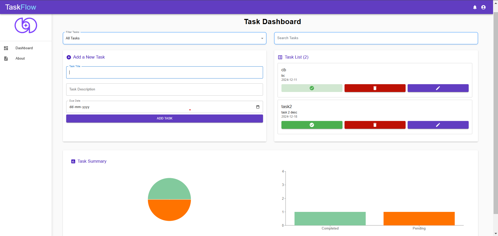

# Task Dashboard  

A React-based task management application built with **Vite**, **Material-UI (MUI)**, **Redux**, and **SCSS**.  

## Key Features  

- **Task Management**:  
  - Add tasks with title, description, and due date.  
  - View all tasks in a list with filtering (All, Completed, Pending, Overdue).  
  - Mark tasks as completed or delete them.  

- **Search and Drag-and-Drop**:  
  - Search tasks by title.  
  - Reorder tasks using drag-and-drop functionality.  

- **Analytics and Visualizations**:  
  - Pie chart and bar chart summaries for completed and pending tasks.  

- **Task Editing**:  
  - Navigate to a dedicated page to edit existing tasks.  

- **Responsive Design**:  
  - Fully responsive interface with Material-UI and SCSS styling.  

  

## Highlights  

- **Modern UI**: Built with Material-UI components for a sleek and responsive design.  
- **Interactive Features**: Real-time task filtering and analytics with intuitive charts.  
- **User Feedback**: Notifications for task actions using `react-toastify`.  

## Visuals  

- **No Tasks**: Displays a friendly message and graphic when no tasks are available.  
- **Drag-and-Drop**: Interactive reordering for better task management.  
- **Charts**: Dynamic visual summary of task statuses.  

